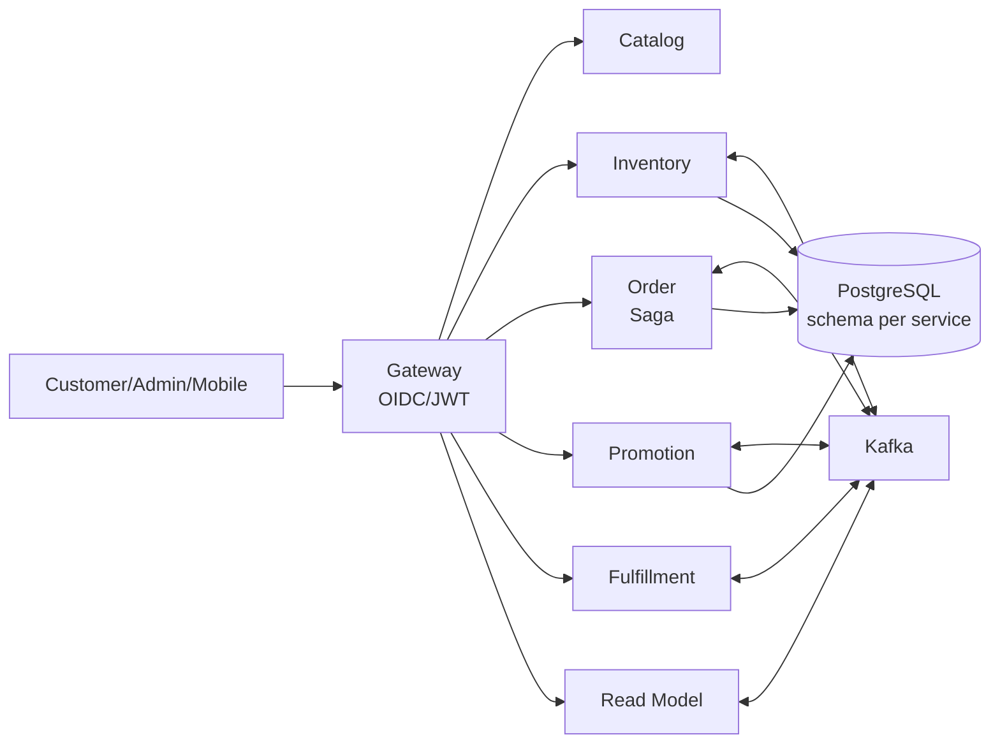
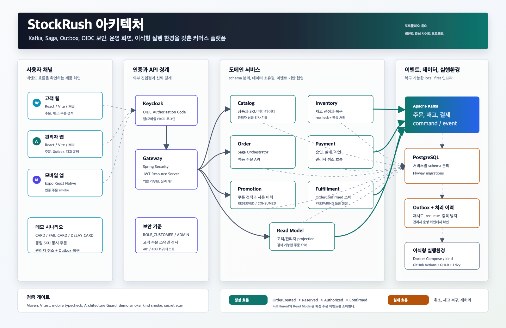
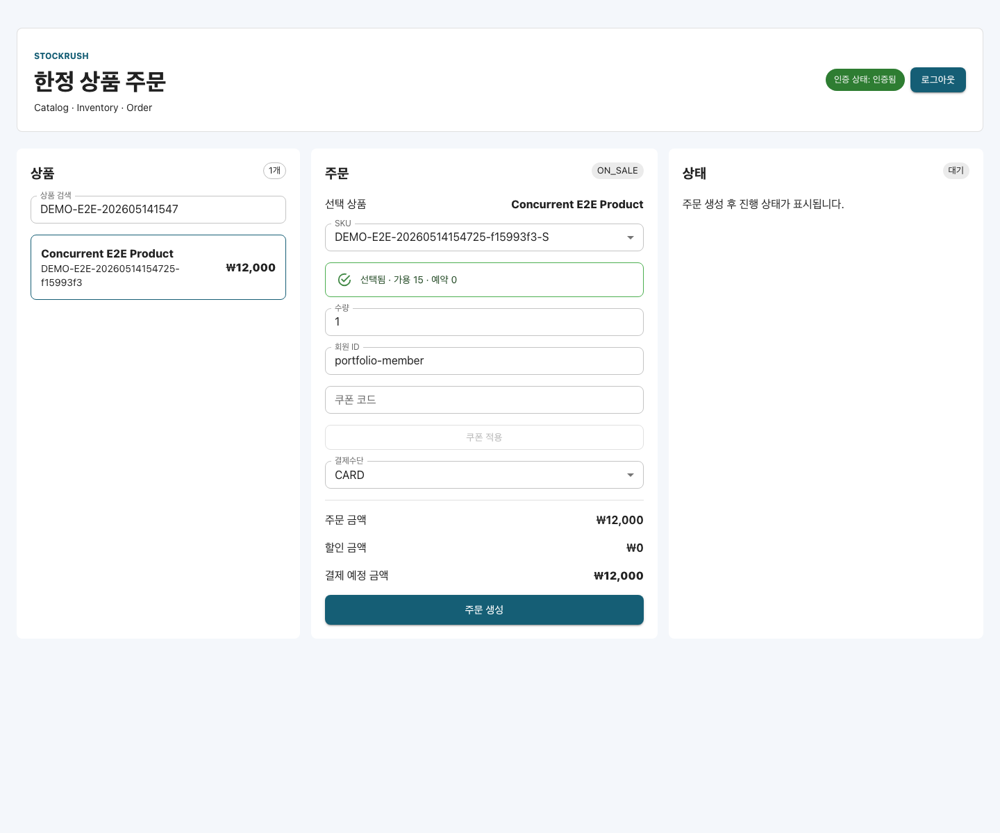
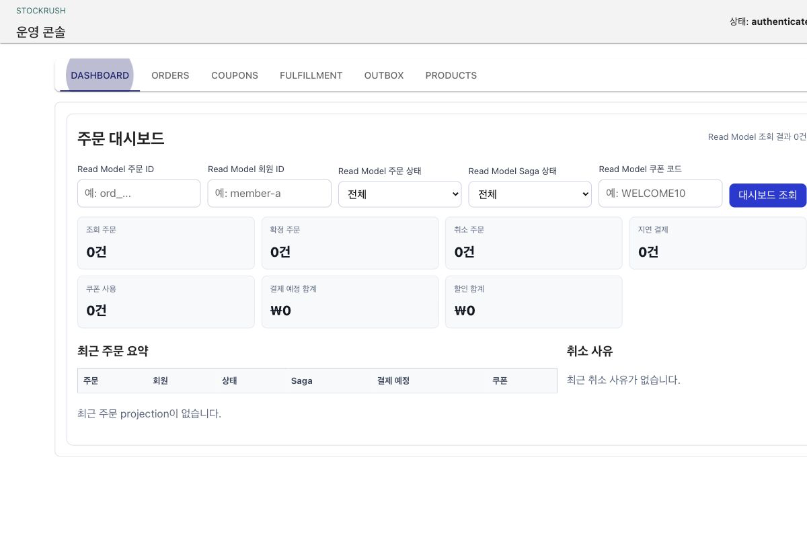
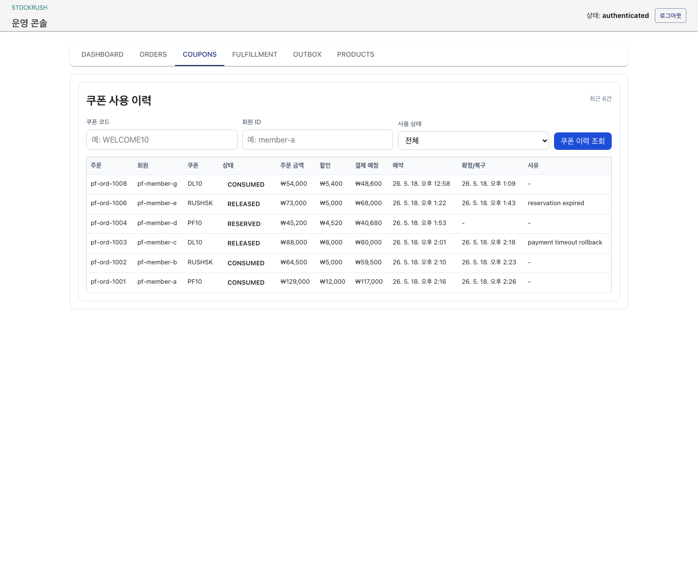
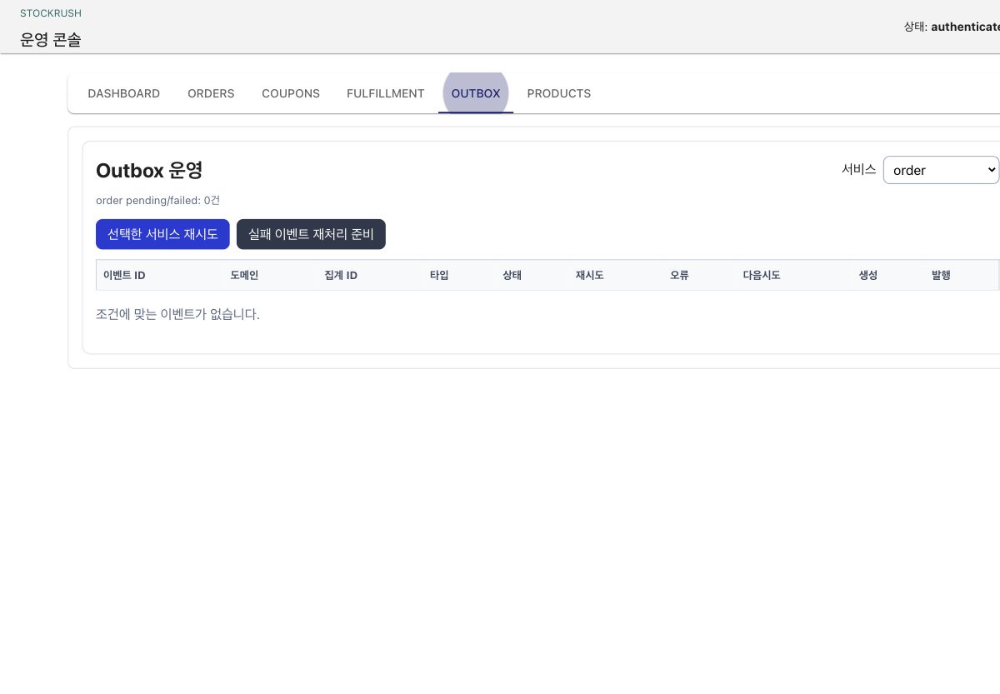

# StockRush

[](https://github.com/cyson21/stockrush/actions/workflows/ci.yml)
[](https://github.com/cyson21/stockrush/actions/workflows/release-images.yml)


StockRush는 한정 판매 커머스에서 주문, 재고, 결제, 쿠폰, 출고, 조회 모델을 분리했을 때 생기는 상태 수렴과 운영 복구 문제를 다루는 백엔드 중심 프로젝트입니다. 주문은 Kafka, Outbox, Saga, 멱등성 키, 재고 선점, 결제 결과, 관리자 운영 액션을 거쳐 최종 상태로 수렴합니다.

## 한눈에 보기

| 항목 | 내용 |
|---|---|
| 문제 | 동시 주문, 결제 실패, 지연 결제, Kafka 중단 상황에서도 주문/재고/조회 상태가 일관되게 수렴해야 함 |
| 핵심 역량 | Java 17, Spring Boot, Kafka, Saga, Transactional Outbox, OIDC Gateway, Docker Compose |
| 백엔드 초점 | 주문 상태 수렴, 재고 선점, Outbox 복구, Gateway 보안, 운영자 보정 |
| 대표 증거 | 동일 SKU 동시 주문, 결제 실패/지연, Kafka outage, Gateway 보안, 모바일 보호 주문 smoke |
| 실행 기준 | `./scripts/demo-up.sh` → `./scripts/demo-smoke.sh` → `./scripts/demo-down.sh` |
| 범위 경계 | 로컬 데모와 CI 증거는 분리 관리하며, 운영 규모 성능이나 HA 운영은 별도 주장하지 않음 |

## 핵심 성과

| 성과 | 상태 | 근거 |
|---|---|---|
| 주문/재고 수렴 | 동일 SKU 주문 6건 중 재고 3개만 완료, oversell 없이 `available=0`, `reserved=0` 수렴 | `./scripts/demo-smoke.sh`, local E2E runner |
| 이벤트 복구 | Kafka 일시 중단 중 outbox에 대기한 이벤트가 broker 복구 후 최종 상태로 반영 | Kafka outage smoke |
| 보안 경계 | 고객 주문 소유권 위반과 권한 부족 요청을 Gateway에서 차단 | Gateway security smoke, Architecture Guard |
| 운영자 보정 | 지연 결제, 쿠폰, Saga, Outbox 상태를 관리자 화면에서 관측/보정 | Admin app tests, demo screenshots |

## 왜 만들었나

단순 CRUD 커머스가 아니라 실제 백엔드 면접에서 질문이 깊어지는 지점에 집중했습니다. 주문 생성 이후 재고 예약, 결제 결과, 이벤트 발행, 조회 모델 반영, 운영자 보정이 각각 실패할 수 있으므로, 서비스 경계와 복구 흐름을 코드와 시나리오로 보여주는 것이 목표입니다.

## 백엔드 설계 포인트

| 포인트 | 선택 이유 | 구현/검증 |
|---|---|---|
| Transactional Outbox | DB commit과 Kafka publish 사이의 유실 가능성을 줄이고 재처리 기준을 남기기 위함 | 서비스별 outbox relay, Kafka outage smoke |
| Saga 기반 주문 상태 | 결제/재고/쿠폰/출고가 모두 독립 실패할 수 있어 단일 트랜잭션보다 단계별 보정이 적합 | Order Saga, 관리자 보정 화면 |
| Gateway-only 외부 진입 | 내부 서비스 port 노출과 권한 우회를 막기 위함 | `architecture-guard check`, Gateway smoke |
| schema-per-service | 단일 PostgreSQL 비용으로 서비스별 데이터 소유권과 migration 책임을 드러내기 위함 | Flyway migration, 서비스별 schema |

## 아키텍처



서비스는 하나의 PostgreSQL 인스턴스를 공유하되 schema를 분리합니다. 사이드 프로젝트 비용은 낮추면서도 서비스별 데이터 소유권, 마이그레이션, 이벤트 책임을 드러내기 위한 선택입니다.

## 구현 범위

| 영역 | 구현 내용 | 증거 |
|---|---|---|
| Backend | Gateway, Catalog, Inventory, Order, Payment, Promotion, Fulfillment, Read Model | 서비스별 테스트, local E2E runner |
| Messaging | Kafka command/event topic, 서비스별 Outbox relay, retry, failed requeue, consumer 중복 처리 | `docs/architecture/outbox.md`, `tools/local-e2e/` |
| Persistence | PostgreSQL schema 분리, Flyway migration, 서비스별 감사 row | service test, migration scripts |
| Security | Keycloak OIDC/PKCE, Gateway JWT 검증, 역할 기반 접근, 고객 주문 소유권 검사 | Gateway smoke, Architecture Guard |
| Web/Mobile | 고객 웹, 관리자 웹, Expo 모바일 주문 흐름 | Vitest, typecheck, Android Expo Go smoke |
| Operations | 관리자 주문/Saga/Outbox/쿠폰/출고 화면 | demo screenshots, admin app tests |
| CI/CD | GitHub Actions, GHCR image publish, Trivy scan, AWS 사용 차단 | workflow badges, `scripts/check-no-aws-usage.sh` |

## 대표 시나리오

| 시나리오 | 검증한 문제 | 결과/증거 |
|---|---|---|
| 정상 주문 | `CARD` 주문이 여러 서비스 이벤트를 거쳐 최종 완료되는지 | `CONFIRMED/COMPLETED` 수렴 |
| 결제 실패 | 결제 실패 후 예약 재고가 복구되는지 | `CANCELLED/FAILED`, 재고 복구 |
| 지연 결제 | `PAYMENT_DELAYED` 상태를 운영자가 취소할 수 있는지 | 관리자 취소 후 복구 |
| 동일 SKU 동시 주문 | 초기 재고 3개에 주문 6건이 몰릴 때 oversell이 없는지 | 3건 완료/3건 취소, `available=0`, `reserved=0` |
| 대량 요청 + 멱등성 replay | replay 요청이 주문을 중복 생성하지 않는지 | 요청 60회에서 주문 30건, outbox 잔여분 0 |
| Kafka 일시 중단 | broker pause 중 이벤트가 유실되지 않는지 | outbox 대기 후 unpause 수렴 |
| Gateway 보안 | 인증/권한/소유권 위반을 차단하는지 | `401`, `403`, 고객 주문 소유권 차단 |
| 모바일 보호 주문 | Android Expo Go 로그인 후 보호 주문이 완료되는지 | `ord_20260515233439_6a5f6b71` 완료 증거 |


## 부하/동시성 검증

| 검증 대상 | 방식 | 결과 | 근거 |
|---|---|---|---|
| 동일 SKU 동시 주문 | local E2E runner로 재고 3개에 주문 6건 집중 | 3건 완료/3건 취소, oversell 없음 | `demo-smoke` concurrent scenario |
| 멱등성 replay | 같은 idempotency key 기반 요청 반복 | 요청 60회에서 주문 30건만 생성 | local E2E runner |
| Kafka outage | broker pause/unpause 중 outbox 대기와 재발행 확인 | 이벤트 유실 없이 read model 수렴 | `--kafka-outage` smoke |

## 기술적 의사결정과 트러블슈팅

| 주제 | 문제/선택지 | 적용 | 검증/남은 리스크 |
|---|---|---|---|
| Outbox vs direct publish | DB 저장 후 Kafka publish 실패 시 이벤트 유실 가능 | 서비스별 Outbox relay와 failed requeue | Kafka outage smoke로 로컬 검증, 운영 HA는 범위 밖 |
| Gateway 보안 | 서비스별 외부 port 노출 시 인증 우회 가능 | Gateway만 외부 진입점으로 유지 | Architecture Guard와 route smoke |

## 화면과 아키텍처



| Customer Web | Admin Dashboard |
|---|---|
|  |  |

| Admin Coupons | Admin Outbox |
|---|---|
|  |  |

캡처 재생성 절차는 [Web Visual Smoke Runbook](docs/runbooks/web-visual-smoke.md)에 둡니다.

## 빠른 실행

macOS/Linux:

```bash
./scripts/demo-up.sh
./scripts/demo-smoke.sh
./scripts/demo-down.sh
```

Windows 11 PowerShell:

```powershell
.\scripts\demo-up.ps1
.\scripts\demo-smoke.ps1
.\scripts\demo-down.ps1
```

개별 서비스를 직접 디버깅할 때는 `infra/local`에서 PostgreSQL, Redis, Kafka, Kafka UI만 띄우고 Spring Boot 서비스와 앱을 host 런타임에서 실행합니다.

```bash
cd infra/local
docker compose up -d
```

## 검증

| 구분 | 명령/증거 | 비고 |
|---|---|---|
| Backend services | `scripts/with-java17.sh mvn test` per service | 서비스 단위 회귀 |
| Customer/Admin web | `npm --prefix apps/customer-app test -- --run`, `npm --prefix apps/admin-app test -- --run` | UI 단위 회귀 |
| Mobile app | `npm --prefix apps/mobile-app test`, `npm --prefix apps/mobile-app run typecheck` | Expo 앱 정적 검증 |
| Architecture Guard | `./tools/architecture-guard/architecture-guard check` | Gateway-only, 내부 port 공개 방지 |
| Demo smoke | `./scripts/demo-smoke.sh` | Docker Compose full stack |
| Kafka outage smoke | `./scripts/demo-smoke.sh --kafka-outage` | Outbox 대기/복구 |
| Kubernetes smoke | `./scripts/kind-preflight.sh --tag latest-demo`, `./scripts/kind-smoke.sh` | 선택형 kind runtime |
| Secret/AWS guard | `./scripts/check-no-committed-secrets.sh`, `./scripts/check-no-aws-usage.sh` | 공개 레포 안전장치 |


## 운영/배포

| 항목 | 내용 | 근거 |
|---|---|---|
| 로컬 실행 | Docker Compose 기반 demo stack | `scripts/demo-up.sh`, `infra/demo/` |
| CI/CD | GitHub Actions, GHCR image publish, Trivy scan | workflow badges, release workflow |
| 보안/비용 가드 | secret scan, AWS 사용 차단 | `check-no-committed-secrets`, `check-no-aws-usage` |
| Kubernetes 재현 | kind 기반 선택형 smoke | `scripts/kind-preflight.sh`, `scripts/kind-smoke.sh` |

## 담당 범위

개인 포트폴리오 프로젝트로, 아래 역량을 코드와 검증 산출물로 증명하는 데 초점을 둡니다.

| 영역 | 증명하려는 역량 | 결과 |
|---|---|---|
| 도메인 설계 | 주문/재고/결제/쿠폰/출고 상태 수렴 모델링 | Saga와 Outbox 기반 시나리오 완성 |
| 보안 경계 | Gateway/OIDC/JWT/소유권 검사 | 인증/권한/소유권 smoke |
| 운영 복구 | 장애 상황 관측과 수동 보정 | Admin dashboard, outbox/retry runbook |

## 프로젝트 구조

```text
apps/
  customer-app/        React customer web app
  admin-app/           React admin web app
  mobile-app/          Expo React Native customer app
services/
  gateway/             External API entrypoint and security boundary
  catalog-service/     Product and SKU catalog
  inventory-service/   Stock reservation and release
  order-service/       Order state and Saga orchestration
  payment-service/     Payment authorization simulation
  promotion-service/   Coupon quote and usage lifecycle
  fulfillment-service/ OrderConfirmed to fulfillment request
  read-model-service/  Customer/admin order summaries
infra/
  local/               Development infrastructure
  demo/                Portable demo runtime
  k8s/                 Local kind runtime
tools/
  architecture-guard/  Static project rules
  local-e2e/           Scenario runner
```

## 문서 읽는 순서

| 순서 | 문서 | 목적 |
|---|---|---|
| 1 | [1페이지 요약](docs/portfolio/portfolio-one-pager.md) | 프로젝트 문제와 검증 범위 |
| 2 | [Visual Story](docs/portfolio/visual-story.md) | Saga, Outbox, 보안, CI/CD 이미지 |
| 3 | [Test Strategy](docs/test-strategy.md) | 테스트 계층과 시나리오 증거 |
| 4 | [Local E2E Runbook](docs/runbooks/local-e2e.md) | 로컬 재현 절차 |
| 5 | [Security Architecture](docs/architecture/security.md) | OIDC, Gateway, route 정책 |
| 6 | [Outbox and Consumer Idempotency](docs/architecture/outbox.md) | Outbox relay와 중복 처리 기준 |
| 7 | [Portfolio PDF](docs/portfolio/project-01-stockrush-portfolio.pdf) | 제출용 요약본 |

## 범위 밖

- 로컬 Docker 수치를 운영 규모 성능으로 주장하지 않습니다.
- kind runtime은 로컬 Kubernetes 재현 경로이며, 운영 Kubernetes 배포 보증이 아닙니다.
- 실제 결제, 실제 배송, 실제 외부 PG 연동은 포함하지 않습니다.
- Gateway는 외부 진입점이고, 내부 서비스 신뢰는 소유권/역할 재검증 경로로 별도 설명합니다.
