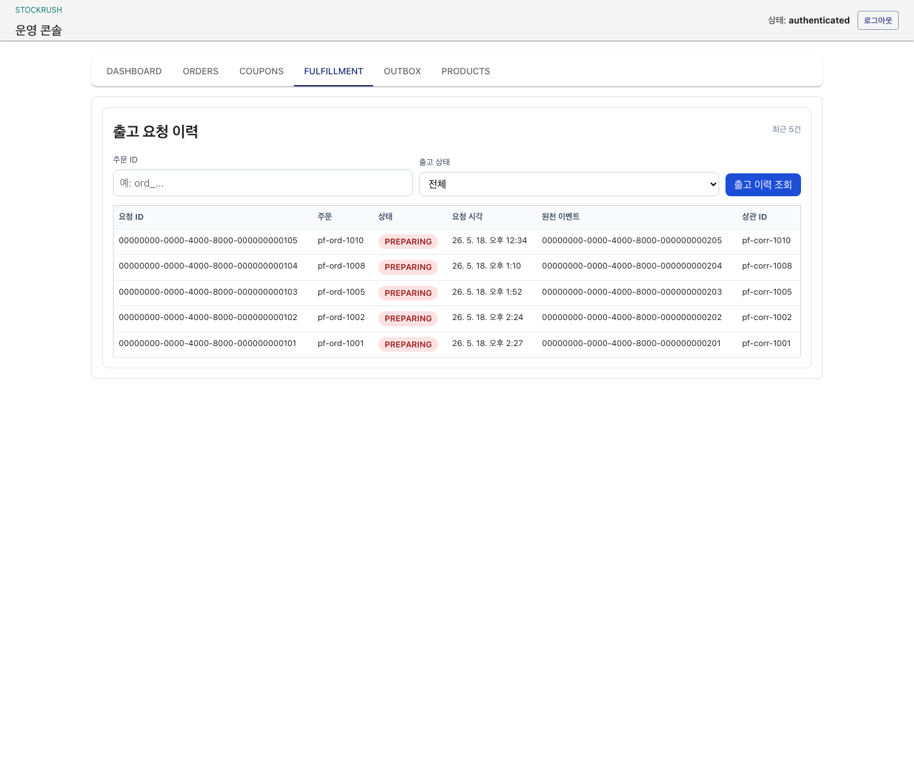
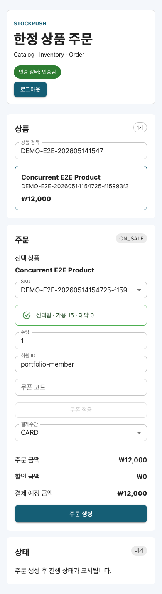
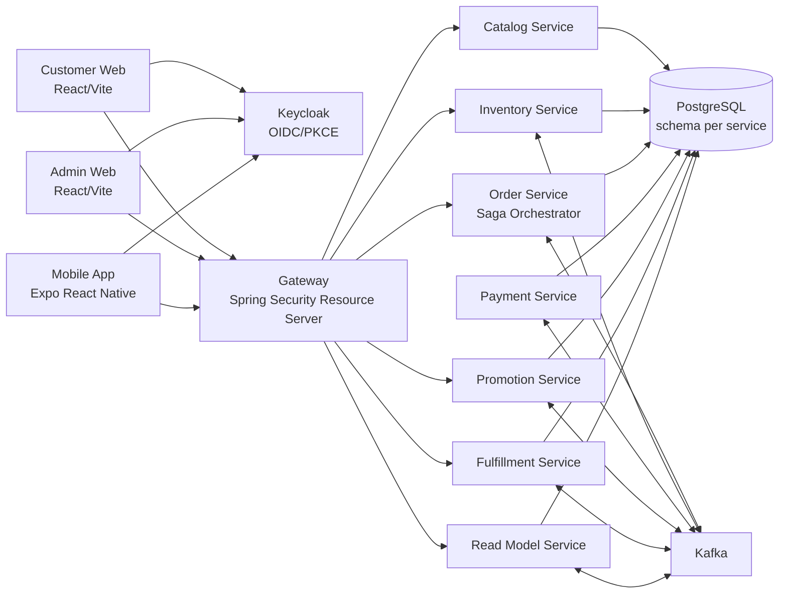
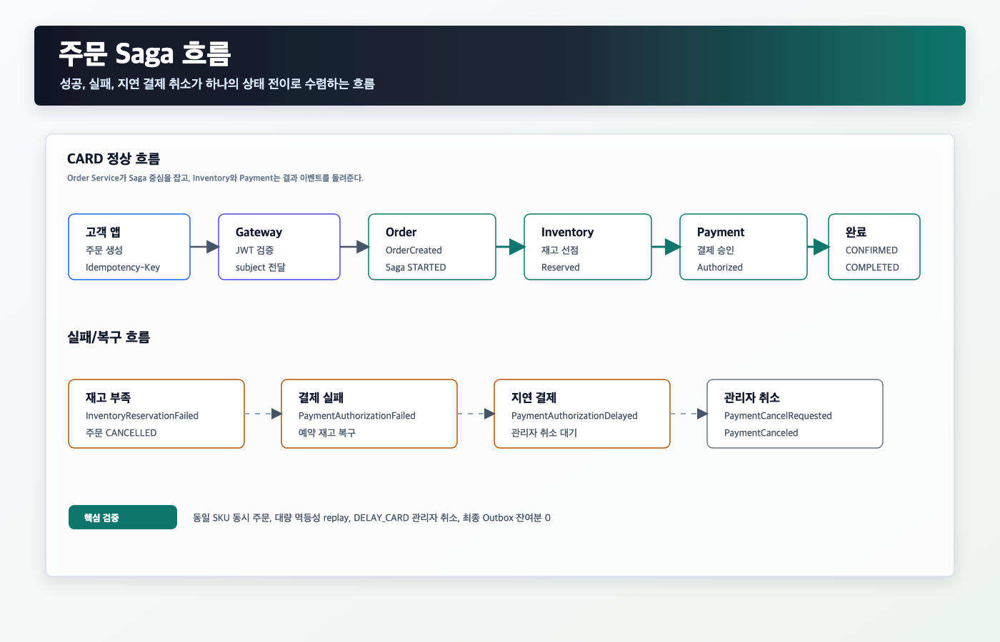
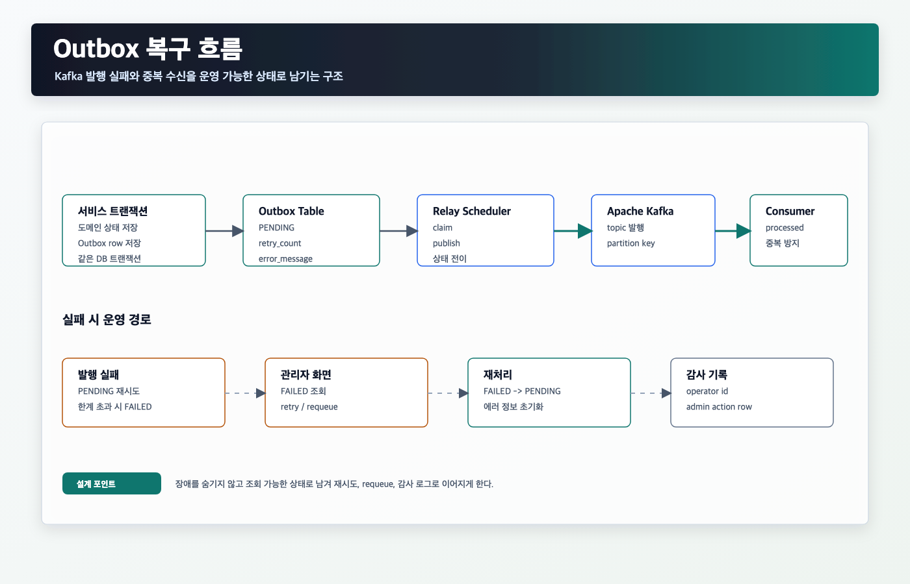
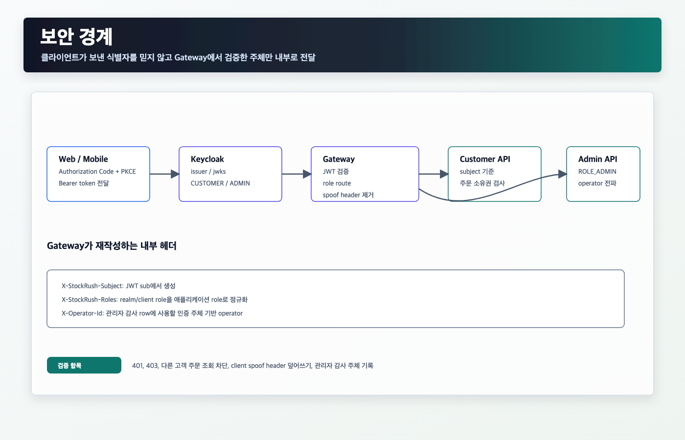
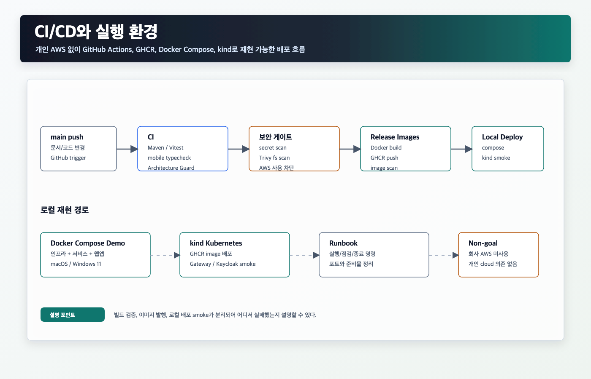

# StockRush

[](https://github.com/cyson21/stockrush/actions/workflows/ci.yml)
[](https://github.com/cyson21/stockrush/actions/workflows/release-images.yml)


StockRush는 한정 판매 커머스에서 주문, 재고, 결제, 쿠폰, 출고, 조회 모델을 분리했을 때 생기는 상태 수렴 문제를 다룬 백엔드 중심 프로젝트입니다.

단순 CRUD보다 실제 장애 지점이 드러나는 흐름에 집중했습니다. 주문 생성은 바로 끝나지 않고 Kafka, Outbox, Saga, 멱등성 키, 재고 선점, 결제 결과, 관리자 운영 액션을 거쳐 최종 상태로 수렴합니다. 고객 웹, 관리자 웹, Expo 모바일 앱은 이 흐름을 직접 확인하기 위한 얇은 제품 화면입니다.

## Highlights

| 관점 | 핵심 내용 |
|---|---|
| 주문 흐름 | `CARD`, `FAIL_CARD`, `DELAY_CARD` 주문이 서로 다른 Saga 경로로 수렴 |
| 재고 처리 | 동일 SKU에 주문이 몰릴 때 성공/실패 주문과 최종 재고를 함께 검증 |
| 이벤트 신뢰성 | 서비스별 Outbox relay, retry, failed requeue, consumer 중복 처리 |
| 운영 화면 | 관리자 앱에서 상품, 재고, 주문, Saga, Outbox, 쿠폰, 출고 상태를 확인 |
| 보안 | Keycloak OIDC/PKCE, Gateway JWT 검증, 역할 기반 접근, 고객 주문 소유권 검사 |
| 실행 환경 | macOS와 Windows 11 모두 Docker Compose 데모 런타임으로 재현 |
| 검증 방식 | 단위/통합/UI/E2E/Architecture Guard/CI 보안 스캔을 분리해서 운영 |

## Screens

| Customer Web | Admin Dashboard |
|---|---|
|  |  |

| Admin Coupons | Admin Fulfillment |
|---|---|
|  |  |

| Admin Outbox | Customer Mobile Width |
|---|---|
|  |  |

캡처는 데모 백엔드와 Keycloak 로그인 상태에서 생성했다. 재생성 절차는 [Web Visual Smoke Runbook](docs/runbooks/web-visual-smoke.md)에 둔다.

## 포트폴리오 가이드

| 문서 | 용도 |
|---|---|
| [포트폴리오 PDF](docs/portfolio/project-01-stockrush-portfolio.pdf) | Project 01 제출용 요약본 |
| [1페이지 요약](docs/portfolio/portfolio-one-pager.md) | 프로젝트 문제의식, 구현 범위, 검증 요약 |
| [시각 자료 모음](docs/portfolio/visual-story.md) | 아키텍처, Saga, Outbox, 보안, CI/CD 이미지 모음 |

## Architecture




서비스는 하나의 PostgreSQL 인스턴스를 공유하되 schema를 분리합니다. 사이드 프로젝트에서 운영 비용을 낮추면서도 서비스별 데이터 소유권과 마이그레이션 경계를 드러내기 위한 선택입니다.

### 상세 흐름

| 주문 Saga | Outbox 복구 |
|---|---|
|  |  |

| 보안 경계 | CI/CD와 실행 환경 |
|---|---|
|  |  |

## Main Flow

1. 고객이 Gateway를 통해 주문을 생성합니다. `Idempotency-Key`와 인증 주체가 함께 들어갑니다.
2. Order Service가 주문과 Outbox 이벤트를 같은 트랜잭션에 저장합니다.
3. Outbox relay가 Kafka로 재고 예약 command를 발행합니다.
4. Inventory Service가 SKU 재고를 선점하거나 실패 이벤트를 발행합니다.
5. 결제 결과에 따라 주문은 `CONFIRMED/COMPLETED`, `CANCELLED/FAILED`, `PAYMENT_DELAYED` 중 하나로 이동합니다.
6. 쿠폰, 출고, 조회 모델 서비스는 주문 이벤트를 소비해 각자의 상태를 갱신합니다.
7. 관리자는 지연 결제 취소, Outbox 재처리, 상품/재고 변경 같은 운영 액션을 별도 화면에서 수행합니다.

## Implemented Scope

| 영역 | 구현 내용 |
|---|---|
| Backend | Gateway, Catalog, Inventory, Order, Payment, Promotion, Fulfillment, Read Model |
| Messaging | Kafka topic 기반 command/event 흐름, 서비스별 Outbox, consumer 중복 처리 |
| Persistence | PostgreSQL schema 분리, Flyway migration, 서비스별 감사 row |
| Customer Web | 상품 조회, SKU 재고, 쿠폰 견적, 주문 생성, 주문 상태 polling, OIDC 로그인 |
| Admin Web | 주문/Saga 조회, 상품/재고 관리, 쿠폰 사용 이력, 출고 요청, Outbox 운영, OIDC 로그인 |
| Mobile | Expo 기반 상품/SKU 조회, 쿠폰 견적, 보호 주문 생성, 상태 추적, 주문 내역 |
| Security | Keycloak realm import, Gateway JWT 검증, `ROLE_CUSTOMER`/`ROLE_ADMIN`, 고객 주문 소유권 검사 |
| CI/CD | GitHub Actions, GHCR image publish, Trivy scan, AWS 사용 차단 스크립트 |
| Local Runtime | 개발용 인프라 compose, 이식형 데모 compose, 선택형 kind Kubernetes 런타임 |

## Verified Scenarios

| 시나리오 | 확인한 결과 |
|---|---|
| 정상 주문 | `CARD` 주문이 `CONFIRMED/COMPLETED`로 수렴 |
| 결제 실패 | `FAIL_CARD` 주문이 `CANCELLED/FAILED`가 되고 예약 재고 복구 |
| 지연 결제 | `DELAY_CARD` 주문이 `PAYMENT_DELAYED`에 머문 뒤 관리자 취소로 복구 |
| 동일 SKU 동시 주문 | 주문 6건, 초기 재고 3개 기준 3건 완료/3건 취소, 최종 재고 `available=0`, `reserved=0` |
| 대량 요청 + 멱등성 replay | 요청 60회에서 주문 30건 생성, 최종 성공 10건/취소 20건, outbox 잔여분 0 |
| Kafka 일시 중단 | broker pause 중 outbox 대기 관측, unpause 후 주문/재고/outbox 상태 수렴 |
| Gateway 보안 | 인증 없음 `401`, 권한 부족 `403`, 고객 주문 소유권 위반 차단 |
| 모바일 보호 주문 | Android Expo Go에서 Keycloak 로그인 후 주문 `ord_20260515233439_6a5f6b71`이 `CONFIRMED/COMPLETED` 도달 |


## Run Locally

데모 모드는 인프라, 백엔드 서비스, 웹앱을 Docker Compose로 함께 띄웁니다. 다른 PC에서 같은 흐름을 재현할 때는 이 경로가 가장 단순합니다.

```bash
./scripts/demo-up.sh
./scripts/demo-smoke.sh
./scripts/demo-down.sh
```

Windows 11 PowerShell에서는 같은 흐름을 아래 스크립트로 실행합니다.

```powershell
.\scripts\demo-up.ps1
.\scripts\demo-smoke.ps1
.\scripts\demo-down.ps1
```

서비스를 직접 디버깅할 때는 개발 모드를 사용합니다. PostgreSQL, Redis, Kafka, Kafka UI만 Docker로 띄우고 Spring Boot 서비스와 앱은 host 런타임에서 실행합니다.

```bash
cd infra/local
docker compose up -d
```

자세한 실행 순서는 [Local E2E Runbook](docs/runbooks/local-e2e.md), [Services Guide](services/README.md), [Demo Runtime Guide](infra/demo/README.md)에 분리했습니다.

Kubernetes 배포 흐름을 확인할 때는 `kind` 런타임을 사용합니다. GHCR 이미지를 로컬 Kubernetes 클러스터에 배포하고 Gateway, 웹앱, Keycloak endpoint를 smoke로 확인합니다.

```bash
./scripts/kind-up.sh --tag latest-demo
./scripts/kind-smoke.sh
./scripts/kind-down.sh
```

자세한 순서는 [Kubernetes kind Demo](docs/runbooks/kubernetes-kind.md)에 정리했습니다.

## Verification

| Gate | Command |
|---|---|
| Backend services | `scripts/with-java17.sh mvn test` per service |
| Customer/Admin web | `npm --prefix apps/customer-app test -- --run`, `npm --prefix apps/admin-app test -- --run` |
| Mobile app | `npm --prefix apps/mobile-app test`, `npm --prefix apps/mobile-app run typecheck` |
| Architecture Guard | `./tools/architecture-guard/architecture-guard check` |
| Demo smoke | `./scripts/demo-smoke.sh` |
| Kubernetes preflight | `./scripts/kind-preflight.sh --tag latest-demo` |
| Kubernetes smoke | `./scripts/kind-smoke.sh` |
| Kafka outage smoke | `./scripts/demo-smoke.sh --kafka-outage` |
| Secret scan | `./scripts/check-no-committed-secrets.sh` |
| AWS usage guard | `./scripts/check-no-aws-usage.sh` |

CI는 서비스 테스트, 웹/모바일 테스트, Architecture Guard, secret scan, Trivy filesystem scan을 실행합니다. `main` 기준 CI가 통과하면 Release Images workflow가 GHCR 이미지를 발행하고 이미지 스캔을 수행합니다.

## Project Map

```text
apps/
  customer-app/        React customer web app
  admin-app/           React admin web app
  mobile-app/          Expo React Native customer app
services/
  gateway/             External API entrypoint and security boundary
  catalog-service/     Product and SKU catalog
  inventory-service/   Stock reservation and release
  order-service/       Order state and Saga orchestration
  payment-service/     Payment authorization simulation
  promotion-service/   Coupon quote and usage lifecycle
  fulfillment-service/ OrderConfirmed to fulfillment request
  read-model-service/  Customer/admin order summaries
infra/
  local/               Development infrastructure
  demo/                Portable demo runtime
  k8s/                 Kubernetes manifests for local kind runtime
tools/
  architecture-guard/  Static project rules
  local-e2e/           Scenario runner
```

## Key Docs

| 문서 | 내용 |
|---|---|
| [프로젝트 요약](docs/portfolio-summary.md) | 구조와 검증 범위 요약 |
| [포트폴리오 PDF](docs/portfolio/project-01-stockrush-portfolio.pdf) | Project 01 제출용 요약본 |
| [1페이지 요약](docs/portfolio/portfolio-one-pager.md) | 포트폴리오 제출용 1페이지 요약 |
| [시각 자료 모음](docs/portfolio/visual-story.md) | 아키텍처와 핵심 흐름 이미지 모음 |
| [Visual Assets](docs/portfolio/visual-assets.md) | 아키텍처 이미지 원본, PNG, Figma/Canva 활용 기준 |
| [Phase 1 Commerce Foundation](docs/architecture/phase-1-commerce-foundation.md) | 주문/재고/결제 중심 구조 |
| [Security Architecture](docs/architecture/security.md) | OIDC, Gateway 보안, route 정책 |
| [Outbox and Consumer Idempotency](docs/architecture/outbox.md) | Outbox relay와 중복 처리 기준 |
| [Event Envelope](docs/architecture/events.md) | Kafka 메시지 envelope |
| [Test Strategy](docs/test-strategy.md) | 테스트 계층과 시나리오 증거 |
| [Web Visual Smoke](docs/runbooks/web-visual-smoke.md) | 웹 화면 캡처와 시각 점검 절차 |
| [CI/CD 운영 기준](docs/ci-cd.md) | GitHub Actions, GHCR, 로컬 배포 |
| [AI Development Process](docs/ai-development-process.md) | agent 기반 개발 운영 기록 |
| [Troubleshooting](docs/troubleshooting/phase-1-commerce-foundation.md) | 구현 중 발견한 문제와 재발 방지 |

## Boundaries

완료 범위와 남겨둔 범위를 구분해 둡니다.

- iOS 실기동 증거는 full Xcode `simctl` 환경이 없어 Android Expo Go 증거로 대체했습니다.
- Fulfillment는 출고 준비 상태까지 구현했고 carrier, label, tracking은 후속 확장 범위입니다.
- 고객 상품 검색은 Catalog API와 Customer App UI로 처리하며 별도 검색 projection은 만들지 않았습니다.
- 동일 SKU E2E는 최종 상태 검증 목적입니다. 외부 부하 벤치마크와 Kafka consumer 병렬성 튜닝은 별도 과제로 남겼습니다.
- 서비스-local 직접 호출은 개발 편의용이고, 외부 진입점은 Gateway입니다.
