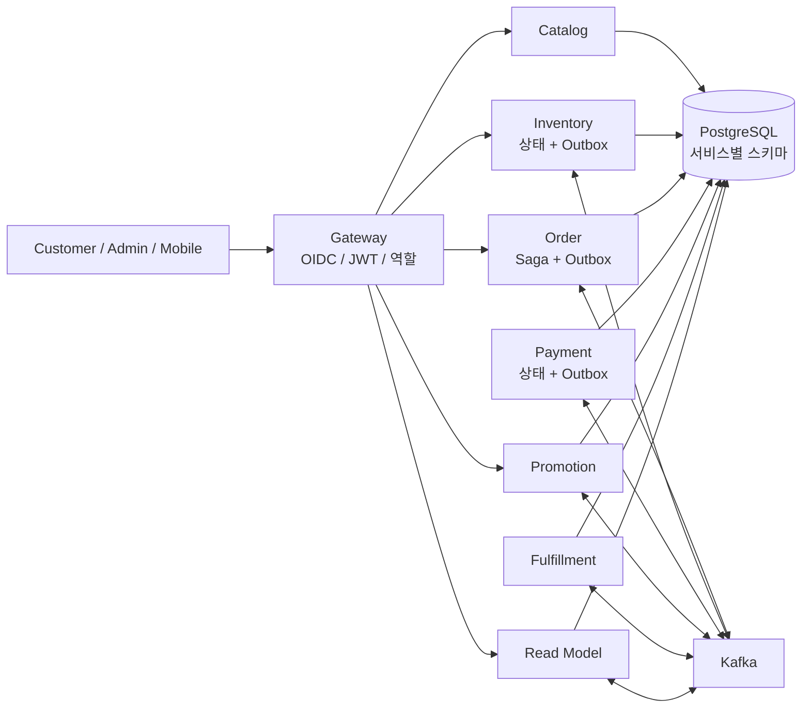

# StockRush

StockRush는 한정 판매 커머스에서 주문, 재고, 결제, 쿠폰, 출고, 조회 모델을 분리했을 때 발생하는 부분 실패와 상태 수렴을 다루는 Java/Spring 백엔드 프로젝트입니다. 주문 상태와 이벤트 발행 상태를 함께 추적하고, 중복 요청·결제 실패·Kafka 중단을 로컬 시나리오로 재현합니다.

외부 요청은 Gateway를 통과하며 Order, Inventory, Payment 서비스는 각자 상태 변경과 Outbox 기록을 관리합니다.

## 포트폴리오 링크

- [웹 사례](https://cyson21.github.io/projects/stockrush/) · [전체 포트폴리오 PDF](https://github.com/cyson21/portfolio-hub/releases/download/latest/portfolio-complete.pdf) · [최신 이력서](https://github.com/cyson21/portfolio-hub/releases/download/latest/resume.pdf)

## 한눈에 보기

| 항목 | 내용 |
|---|---|
| 문제 | 분리된 주문·재고·결제 서비스에서 중복 요청, 부분 실패, 이벤트 발행 지연이 발생해도 최종 상태가 모순 없이 정리되어야 함 |
| 핵심 구현 | Saga 상태 전이, Transactional Outbox, 소비자 멱등 처리, 재고 선점, Gateway 인증·권한 경계 |
| 기술 | Java 17, Spring Boot 4.0.6, PostgreSQL, Kafka, Redis, Keycloak, Docker Compose |
| 검증 | 서비스 통합 테스트, Architecture Guard, 전체 데모 스모크, 동일 SKU 동시 주문, Kafka pause/unpause 복구 시나리오 |
| 담당 | 개인 프로젝트로 도메인 모델, 백엔드 서비스, Gateway, 로컬 인프라, 테스트·복구 도구를 직접 설계하고 구현 |
| 범위 | 실제 결제·배송 연동과 운영 환경 부하·장애 복구는 포함하지 않음 |

## 아키텍처


```mermaid
flowchart LR
  Client["Customer / Admin / Mobile"] --> Gateway["Gateway<br/>OIDC / JWT / 역할"]
  Gateway --> Catalog["Catalog"]
  Gateway --> Inventory["Inventory<br/>상태 + Outbox"]
  Gateway --> Order["Order<br/>Saga + Outbox"]
  Gateway --> Promotion["Promotion"]
  Gateway --> ReadModel["Read Model"]

  Order <--> Kafka["Kafka"]
  Inventory <--> Kafka
  Payment["Payment<br/>상태 + Outbox"] <--> Kafka
  Promotion <--> Kafka
  Fulfillment["Fulfillment"] <--> Kafka
  ReadModel <--> Kafka

  Catalog --> Postgres[("PostgreSQL<br/>서비스별 스키마")]
  Inventory --> Postgres
  Order --> Postgres
  Payment --> Postgres
  Promotion --> Postgres
  Fulfillment --> Postgres
  ReadModel --> Postgres
```

데모 환경은 하나의 PostgreSQL 인스턴스를 사용하되 서비스별 스키마와 Flyway 마이그레이션을 분리합니다. 고객·관리자 HTTP 경로는 Gateway로 모으고, 서비스 간 상태 변화는 Kafka 이벤트와 서비스별 저장소를 통해 전달합니다. 상세 경계는 [Security Architecture](docs/architecture/security.md)와 [Outbox and Consumer Idempotency](docs/architecture/outbox.md)에 정리했습니다.

## 핵심 설계 판단

| 판단 | 적용 방식 | 구현 근거 | 테스트 근거 |
|---|---|---|---|
| DB 반영과 이벤트 발행 사이의 간극을 Outbox로 관리 | 주문 저장과 Outbox 레코드를 같은 트랜잭션에 기록하고 릴레이가 `PENDING` 이벤트를 선점해 발행 | [PersistentCreateOrderService](services/order-service/src/main/java/com/stockrush/order/application/PersistentCreateOrderService.java), [OutboxRelayService](services/order-service/src/main/java/com/stockrush/order/infra/outbox/OutboxRelayService.java) | [PersistentCreateOrderServiceIntegrationTest](services/order-service/src/test/java/com/stockrush/order/infra/persistence/PersistentCreateOrderServiceIntegrationTest.java), [OutboxRelayServiceIntegrationTest](services/order-service/src/test/java/com/stockrush/order/infra/outbox/OutboxRelayServiceIntegrationTest.java) |
| 재고 변경과 결과 이벤트를 한 트랜잭션 경계에서 처리 | 예약·해제 결과와 Inventory Outbox를 함께 기록 | [InventoryReservationHandler](services/inventory-service/src/main/java/com/stockrush/inventory/application/InventoryReservationHandler.java) | [InventoryReservationHandlerIntegrationTest](services/inventory-service/src/test/java/com/stockrush/inventory/application/InventoryReservationHandlerIntegrationTest.java) |
| 결제 결과를 주문 상태와 분리 | 승인 성공·실패·지연·취소를 Payment 이벤트로 기록하고 Outbox로 전달 | [PaymentAuthorizationHandler](services/payment-service/src/main/java/com/stockrush/payment/application/PaymentAuthorizationHandler.java) | [PaymentAuthorizationHandlerIntegrationTest](services/payment-service/src/test/java/com/stockrush/payment/application/PaymentAuthorizationHandlerIntegrationTest.java), [PaymentOutboxRelayServiceIntegrationTest](services/payment-service/src/test/java/com/stockrush/payment/infra/outbox/PaymentOutboxRelayServiceIntegrationTest.java) |
| 외부 진입점을 Gateway로 제한 | JWT 사용자 식별자와 역할을 검증하고 내부 서비스로 신뢰 헤더·상관관계 ID를 전달 | [OrderGatewayController](services/gateway/src/main/java/com/stockrush/gateway/api/OrderGatewayController.java), [GatewayServiceProxy](services/gateway/src/main/java/com/stockrush/gateway/api/GatewayServiceProxy.java) | [OrderGatewayControllerIntegrationTest](services/gateway/src/test/java/com/stockrush/gateway/api/OrderGatewayControllerIntegrationTest.java), [Architecture Guard tests](tools/architecture-guard/tests/test_architecture_guard.py) |
| 로컬 관리자 복구 경로를 API로 명시 | Order·Inventory·Payment Outbox 조회, 재시도, 실패 레코드 재등록 요청을 Gateway로 라우팅 | [AdminOutboxGatewayController](services/gateway/src/main/java/com/stockrush/gateway/api/AdminOutboxGatewayController.java) | [OrderGatewayControllerIntegrationTest](services/gateway/src/test/java/com/stockrush/gateway/api/OrderGatewayControllerIntegrationTest.java), [OutboxAdminControllerIntegrationTest](services/order-service/src/test/java/com/stockrush/order/api/OutboxAdminControllerIntegrationTest.java) |

## 검증 시나리오

| 시나리오 | 보호하는 규칙 | 증거 |
|---|---|---|
| 정상·실패·지연 결제 주문 | 결제 결과에 따라 주문 상태와 예약 재고가 최종 상태로 정리됨 | [`demo-order-flow`](tools/local-e2e/local_e2e_runner.py), [OrderSagaEventHandlerIntegrationTest](services/order-service/src/test/java/com/stockrush/order/application/OrderSagaEventHandlerIntegrationTest.java) |
| 동일 SKU 동시 주문 | 초기 재고를 초과한 주문이 완료되지 않고 예약 수량이 남지 않음 | [`same-sku-concurrency` 실행 절차](docs/runbooks/local-e2e.md#동일-sku-concurrency), [InventoryReservationHandlerIntegrationTest](services/inventory-service/src/test/java/com/stockrush/inventory/application/InventoryReservationHandlerIntegrationTest.java) |
| 멱등성 key 재전송 | 같은 요청의 재전송이 새 주문을 중복 생성하지 않음 | [`burst-idempotency` 실행 절차](docs/runbooks/local-e2e.md#burst-idempotency), [CreateOrderControllerIntegrationTest](services/order-service/src/test/java/com/stockrush/order/api/CreateOrderControllerIntegrationTest.java) |
| Kafka 일시 중단 | 브로커 중단 동안 Outbox 대기를 관측하고 재개 후 신규 미처리 이벤트 없이 상태가 수렴함 | [`kafka-outage-recovery` 실행 절차](docs/runbooks/local-e2e.md#kafka-outage-recovery), [demo-smoke.sh](scripts/demo-smoke.sh) |
| 인증·권한·소유권 위반 | 비인증 요청, 고객 역할의 관리자 경로 접근, 사용자 식별자 위조를 Gateway에서 차단 | [OrderGatewayControllerIntegrationTest](services/gateway/src/test/java/com/stockrush/gateway/api/OrderGatewayControllerIntegrationTest.java), [CreateOrderControllerIntegrationTest](services/order-service/src/test/java/com/stockrush/order/api/CreateOrderControllerIntegrationTest.java) |
| Outbox 복구 시뮬레이션 | `PENDING`/`FAILED` 레코드의 재시도·재등록과 관리자 작업 추적값을 확인 | [`outbox-recovery` 실행 절차](docs/runbooks/local-e2e.md#outbox-recovery), [OutboxRelayServiceIntegrationTest](services/order-service/src/test/java/com/stockrush/order/infra/outbox/OutboxRelayServiceIntegrationTest.java) |

[Local E2E Runbook](docs/runbooks/local-e2e.md)에는 실행 명령과 과거 로컬 결과 스냅샷이 함께 있습니다. README의 명령은 현재 재현 경로이고, 실행 문서에 적힌 특정 주문 수·ID·시각은 해당 실행 기록으로만 해석합니다.

## 재현 방법

### 1. 전체 데모

필수 도구는 Docker Engine, Docker Compose v2, `curl`, `python3`입니다. `demo-up`은 `infra/demo/.env`가 없으면 예제 파일을 복사하고 전체 이미지를 `--build`하므로 첫 실행에는 이미지 빌드 시간이 필요합니다.

기본 호스트 포트는 Gateway `28080`, Keycloak `28088`, Customer Web `15173`, Admin Web `15174`, PostgreSQL `25432`, Redis `26379`, Kafka `29092`, Kafka UI `29090`입니다. 포트는 `infra/demo/.env`에서 변경할 수 있습니다.

```bash
(
  set -e
  trap './scripts/demo-down.sh' EXIT
  ./scripts/demo-up.sh
  ./scripts/demo-smoke.sh
)
```

기본 스모크는 상태 확인, 인증 토큰 발급, 정상·실패·지연 결제 흐름, 멱등성 재전송 시나리오를 실행합니다. 장애 주입은 다른 로컬 검증과 동시에 실행하지 않습니다.

```bash
(
  set -e
  trap './scripts/demo-down.sh' EXIT
  ./scripts/demo-up.sh
  ./scripts/demo-smoke.sh --kafka-outage
)
```

### 2. 동일 SKU 동시 주문

Java 서비스와 `infra/local` 인프라를 호스트 개발 모드로 기동하고 `STOCKRUSH_ADMIN_BEARER_TOKEN`, `STOCKRUSH_CUSTOMER_BEARER_TOKEN`을 준비한 뒤 실행합니다. 토큰 발급과 서비스 기동 순서는 [Local E2E Runbook](docs/runbooks/local-e2e.md)을 따릅니다.

```bash
./tools/local-e2e/local-e2e same-sku-concurrency \
  --orders 6 \
  --initial-stock 3 \
  --quantity 1 \
  --max-attempts 12
```

검증기는 완료·취소 건수뿐 아니라 최종 `availableQuantity`, `reservedQuantity`, 서비스별 `pendingOutboxDelta`를 함께 확인합니다.

### 3. 백엔드와 구조 검사

Java 17, Maven 3.9 이상, Docker Compose가 필요합니다. 다수 통합 테스트는 `infra/local`의 PostgreSQL `15432`와 Kafka `19092`를 사용하며, `infra/demo`의 PostgreSQL `25432`로 대체되지 않습니다. 루트에는 `pom.xml`이 없으므로 서비스별로 실행합니다.

```bash
(
  set -e
  trap 'docker compose -f infra/local/docker-compose.yml down' EXIT
  cp -n infra/local/.env.example infra/local/.env
  docker compose -f infra/local/docker-compose.yml up -d --wait

  for service in gateway catalog-service inventory-service order-service payment-service promotion-service fulfillment-service read-model-service; do
    (cd "services/$service" && ../../scripts/with-java17.sh mvn test)
  done

  ./tools/architecture-guard/architecture-guard check
)
```

웹과 모바일 검증에는 Node.js 20.19.4 이상과 npm이 필요합니다. 각 앱은 추적된 lockfile로 의존성을 설치한 뒤 검증합니다.

```bash
set -e
npm --prefix apps/customer-app ci
npm --prefix apps/admin-app ci
npm --prefix apps/mobile-app ci

npm --prefix apps/customer-app test -- --run
npm --prefix apps/admin-app test -- --run
npm --prefix apps/mobile-app test
npm --prefix apps/mobile-app run typecheck
```

## 담당 범위

| 영역 | 직접 구현한 범위 |
|---|---|
| 도메인·데이터 | 주문 Saga 상태, 재고 예약·해제, 결제 결과, 쿠폰·출고·조회 projection, 서비스별 스키마 |
| 이벤트 처리 | 서비스별 Outbox 릴레이, 실패 상태 기록, 재시도·재등록, 소비자 중복 처리 |
| 보안 경계 | Keycloak OIDC, Gateway JWT·역할 검사, 고객 사용자 식별자 전달과 소유권 검사 |
| 검증 도구 | 서비스 통합 테스트, Architecture Guard, Local E2E runner, Docker Compose 스모크 |
| 화면 | 고객 주문 웹, 관리자 조회·복구 화면, Expo 모바일 보호 주문 흐름 |

## 제한 사항

- 동시성·복구 결과는 고정된 로컬 환경의 기능 검증이며 처리량, 지연시간, 운영 SLO를 측정한 결과가 아닙니다.
- Kafka 장애 시나리오는 단일 broker를 `pause/unpause`한 범위이며 다중 broker 장애나 장기 복구를 검증하지 않습니다.
- 관리자 기능은 로컬 장애 관측·복구 시뮬레이션입니다. 실제 조직의 승인 절차나 운영 권한 체계를 모델링하지 않습니다.
- 결제와 배송은 내부 시뮬레이션이며 외부 PG·물류 시스템과 연결하지 않습니다.
- kind 경로는 로컬 Kubernetes 재현용이며 운영 Kubernetes의 가용성을 보증하지 않습니다.

## 관련 문서

| 문서 | 내용 |
|---|---|
| [Local E2E Runbook](docs/runbooks/local-e2e.md) | 개발·데모 실행, 동시 주문, 멱등성, Outbox·Kafka 복구 절차와 기록 |
| [Test Strategy](docs/test-strategy.md) | 테스트 계층과 시나리오별 검증 범위 |
| [Outbox and Consumer Idempotency](docs/architecture/outbox.md) | Outbox relay, 실패 상태, 소비자 중복 처리 기준 |
| [Security Architecture](docs/architecture/security.md) | OIDC, Gateway route, role·소유권 검사 |
| [Architecture Guard Rules](docs/architecture/architecture-guard-rules.md) | 외부 port와 Gateway 경계를 검사하는 정적 규칙 |
| [Mobile Protected Order Smoke](docs/runbooks/mobile-protected-order-smoke.md) | Expo Go 환경의 보호 주문 로컬 확인 기록 |
| [Web Visual Smoke](docs/runbooks/web-visual-smoke.md) | 고객·관리자 화면 캡처와 시각 점검 절차 |
