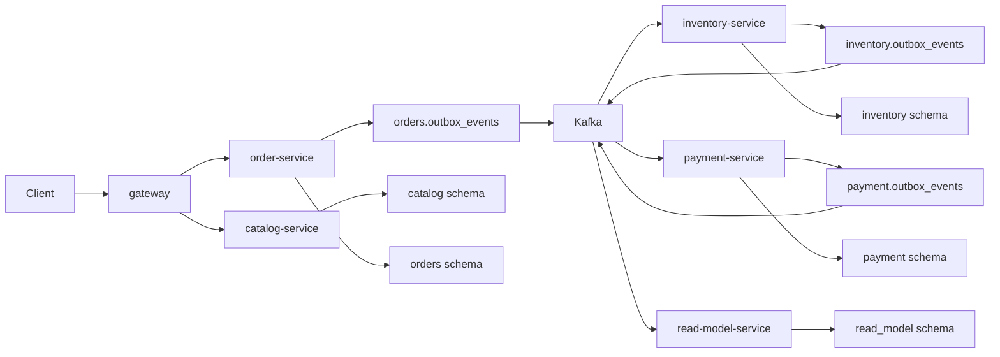

# Phase 1 Commerce Foundation

## Scope

Phase 1 creates the local runtime shape for the core commerce flow.



## Service Boundaries

| Service | Owns | Does Not Own |
|---|---|---|
| `gateway` | local entrypoint and healthcheck | business state |
| `catalog-service` | product, category, price, sales status | stock quantity, order status, payment state |
| `inventory-service` | SKU stock, reservation, stock finalization/release | product master, order lifecycle, payment state |
| `order-service` | customer order, order item, order status, Saga status, payment command outbox | stock mutation, payment authorization result |
| `payment-service` | payment authorization, payment delay/cancel simulation, payment event outbox | order lifecycle, inventory reservation |
| `read-model-service` | order summary projection for customer history and admin order list | order command handling, stock/payment mutation, product search projection |

Each service uses only its own PostgreSQL schema. Cross-service workflow moves through Kafka events and commands, not direct schema access.

## End-to-End Data Flow

```text
Customer App
  -> order-service POST /api/orders
  -> orders.customer_orders + orders.outbox_events
  -> stockrush.order.events.v1
  -> inventory-service processed_events + inventory reservation
  -> inventory.outbox_events
  -> stockrush.inventory.events.v1
  -> order-service Saga handler
  -> orders.outbox_events PaymentAuthorizationRequested
  -> stockrush.payment.commands.v1
  -> payment-service processed_events + payment row
  -> payment.outbox_events
  -> stockrush.payment.events.v1
  -> order-service final Saga handler
  -> stockrush.order.events.v1 OrderConfirmed or OrderCancelled
  -> inventory-service reservation finalization or release
  -> fulfillment-service shipment preparation on OrderConfirmed
  -> read-model-service order summary projection on OrderCreated/OrderConfirmed/OrderCancelled
```

The customer app reads order status through `GET /api/orders/{orderId}`. The admin app reads order/Saga state and service-specific outbox rows through Gateway admin APIs.
Read Model Service currently exposes service-local summary APIs and is not proxied by Gateway.

## First Demo Scenario

1. Customer requests an order.
2. Order state starts as `CREATED`.
3. Inventory reservation succeeds or fails.
4. Payment authorization succeeds or fails.
5. Order state ends as `CONFIRMED` or `CANCELLED`.
6. Customer checks the order detail API for the final order and Saga status.
7. Kafka UI shows the events.
8. Database tables show outbox and processed event records.

## Order Saga State Transitions

| Source Event | Order Status | Saga Status | Next Message |
|---|---|---|---|
| `OrderCreated` | `CREATED` | `STARTED` | `OrderCreated` on `stockrush.order.events.v1` |
| `InventoryReserved` | `CREATED` | `PAYMENT_REQUESTED` | `PaymentAuthorizationRequested` on `stockrush.payment.commands.v1` |
| `InventoryReservationFailed` | `CANCELLED` | `FAILED` | `OrderCancelled` on `stockrush.order.events.v1` |
| `PaymentAuthorized` | `CONFIRMED` | `COMPLETED` | `OrderConfirmed` on `stockrush.order.events.v1` |
| `PaymentAuthorizationFailed` | `CANCELLED` | `FAILED` | `OrderCancelled` on `stockrush.order.events.v1` |
| `PaymentAuthorizationDelayed` | `CREATED` | `PAYMENT_DELAYED` | none |
| Admin cancel request | `CREATED` | `PAYMENT_CANCEL_REQUESTED` | `PaymentCancelRequested` on `stockrush.payment.commands.v1` |
| `PaymentCanceled` | `CANCELLED` | `FAILED` | `OrderCancelled` on `stockrush.order.events.v1` |

`causationId` is preserved in outbox headers and copied into the Kafka envelope by the relay publisher.

## Query API Surface

| Service | API | Purpose |
|---|---|---|
| catalog-service | `GET /api/products`, `GET /api/products/{productCode}` | customer product discovery |
| inventory-service | `GET /api/stocks`, `GET /api/stocks/{skuId}` | customer stock visibility and admin stock check |
| order-service | `GET /api/orders/{orderId}` | customer order status and Saga progress tracking |
| order-service | `GET /api/admin/orders`, `GET /api/admin/orders/{orderId}/saga` | admin order monitoring and Saga failure inspection |
| order-service | `POST /api/admin/orders/{orderId}/cancel` | admin cancellation request for delayed payment orders |
| read-model-service | `GET /api/read-model/orders`, `GET /api/read-model/admin/orders` | projection-backed customer order history and admin order summary |
| gateway | `GET /api/admin/outbox-services/{service}/events`, `POST /api/admin/outbox-services/{service}/events/retry`, `POST /api/admin/outbox-services/{service}/events/failed/requeue` | service-specific outbox monitoring, manual relay trigger, and failed event requeue |

## Service Relay Coverage

| Service | Relay Scope | Verification |
|---|---|---|
| order-service | `stockrush.order.events.v1`, `stockrush.payment.commands.v1` | pending claim, publish success, retry, failed |
| inventory-service | `stockrush.inventory.events.v1` | pending claim, publish success, retry, failed, envelope JSON |
| payment-service | `stockrush.payment.events.v1` | pending claim, publish success, retry, failed, envelope JSON |
| fulfillment-service | none in first slice | order event consumer, processed event idempotency |
| read-model-service | none in first slice | order lifecycle projection, processed event idempotency, query API |

## Kafka Flow and Integration Smoke Coverage

| Flow | Producer Input | Consumer | Relay Output | Verification |
|---|---|---|---|---|
| Inventory reservation | `OrderCreated` on `stockrush.order.events.v1` | inventory-service | `InventoryReserved` on `stockrush.inventory.events.v1` | stock update, processed event, outbox row, Kafka event envelope |
| Inventory finalization | `OrderConfirmed` or `OrderCancelled` on `stockrush.order.events.v1` | inventory-service | `InventoryReservationConfirmed` or `InventoryReservationReleased` on `stockrush.inventory.events.v1` | reservation status, stock recovery/finalization, processed event, outbox row |
| Coupon usage lifecycle | `OrderCreated`, `OrderConfirmed`, or `OrderCancelled` on `stockrush.order.events.v1` | promotion-service | none | coupon usage state, processed event |
| Shipment preparation | `OrderConfirmed` on `stockrush.order.events.v1` | fulfillment-service | none | fulfillment request state, processed event |
| Order summary projection | `OrderCreated`, `OrderConfirmed`, or `OrderCancelled` on `stockrush.order.events.v1` | read-model-service | none | order summary state, processed event, customer/admin query API |
| Payment authorization | `PaymentAuthorizationRequested` on `stockrush.payment.commands.v1` | payment-service | `PaymentAuthorized` on `stockrush.payment.events.v1` | payment row, processed event, outbox row, Kafka event envelope |
| Payment cancellation | `PaymentCancelRequested` on `stockrush.payment.commands.v1` | payment-service | `PaymentCanceled` on `stockrush.payment.events.v1` | delayed payment update, processed event, outbox row, Kafka event envelope |

Smoke tests use the local Docker Kafka broker at `localhost:19092` and the local PostgreSQL schemas at `localhost:15432`.

## Failure Recovery Flow

| Failure Point | Recovery Behavior | Current Proof |
|---|---|---|
| Kafka publish fails from a relay | Outbox row stays retryable or moves to `FAILED` with error detail | service-local relay tests |
| Consumer receives the same message twice | processed event storage prevents duplicate side effects | Saga handler and payment handler tests |
| Inventory reservation fails | Order moves to `CANCELLED` / `FAILED` and emits `OrderCancelled` | order Saga tests |
| Payment authorization fails | Order moves to `CANCELLED` / `FAILED`; inventory releases reservation | service tests and local `FAIL_CARD` runbook |
| Payment authorization is delayed | Order remains `CREATED` / `PAYMENT_DELAYED` until admin action | payment/order tests and local `DELAY_CARD` runbook |
| Admin cancels delayed payment | `PaymentCancelRequested` leads to `PaymentCanceled`, then `OrderCancelled` and stock release | admin cancel API/app tests |
| Outbox row exhausts retry attempts | Admin can requeue `FAILED` rows to `PENDING`; existing relay publishes them later | service-local admin tests, Gateway smoke, Admin App test |
| Operator runs outbox retry/requeue | Service writes `outbox_admin_actions` with operator id, correlation id, batch size, and affected count | service-local admin tests, Admin App test, Gateway smoke |

Failed outbox requeue resets only retry state and error detail. It does not publish directly.

## Design Constraints

- Services are independent Maven projects.
- Each service owns only its PostgreSQL schema.
- Cross-service workflow uses Kafka events.
- Outbox is mandatory for Kafka publishing.
- Consumer idempotency is mandatory before acknowledging an event.
- Redis is not the source of truth for stock.
