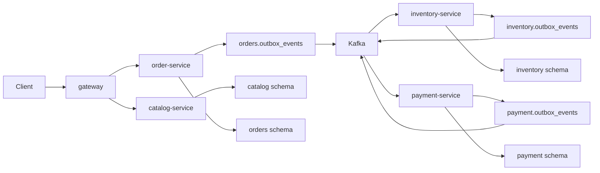

# Phase 1 Commerce Foundation

## Scope

Phase 1 creates the local runtime shape for the core commerce flow.

## First Demo Scenario

1. Customer requests an order.
2. Order state starts as `CREATED`.
3. Inventory reservation succeeds or fails.
4. Payment authorization succeeds or fails.
5. Order state ends as `CONFIRMED` or `CANCELLED`.
6. Kafka UI shows the events.
7. Database tables show outbox and processed event records.

## Design Constraints

- Services are independent Maven projects.
- Each service owns only its PostgreSQL schema.
- Cross-service workflow uses Kafka events.
- Outbox is mandatory for Kafka publishing.
- Consumer idempotency is mandatory before acknowledging an event.
- Redis is not the source of truth for stock.
