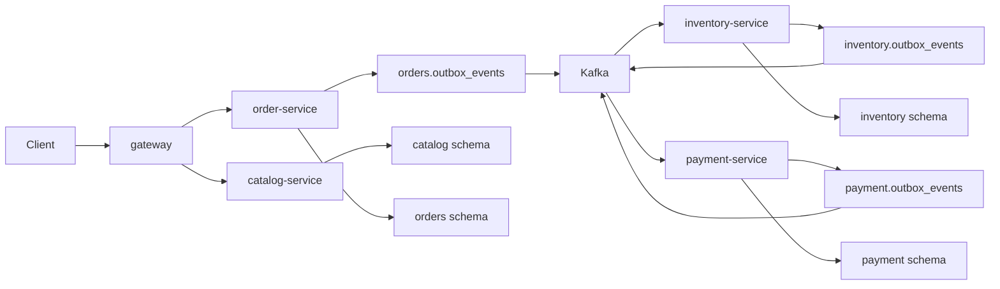

# Phase 1 Commerce Foundation

## Scope

Phase 1 creates the local runtime shape for the core commerce flow.

## First Demo Scenario

1. Customer requests an order.
2. Order state starts as `CREATED`.
3. Inventory reservation succeeds or fails.
4. Payment authorization succeeds or fails.
5. Order state ends as `CONFIRMED` or `CANCELLED`.
6. Kafka UI shows the events.
7. Database tables show outbox and processed event records.

## Order Saga State Transitions

| Source Event | Order Status | Saga Status | Next Message |
|---|---|---|---|
| `OrderCreated` | `CREATED` | `STARTED` | `OrderCreated` on `stockrush.order.events.v1` |
| `InventoryReserved` | `CREATED` | `PAYMENT_REQUESTED` | `PaymentAuthorizationRequested` on `stockrush.payment.commands.v1` |
| `InventoryReservationFailed` | `CANCELLED` | `FAILED` | `OrderCancelled` on `stockrush.order.events.v1` |
| `PaymentAuthorized` | `CONFIRMED` | `COMPLETED` | `OrderConfirmed` on `stockrush.order.events.v1` |
| `PaymentAuthorizationFailed` | `CANCELLED` | `FAILED` | `OrderCancelled` on `stockrush.order.events.v1` |

`causationId` is preserved in outbox headers and copied into the Kafka envelope by the relay publisher.

## Service Relay Coverage

| Service | Relay Scope | Verification |
|---|---|---|
| order-service | `stockrush.order.events.v1`, `stockrush.payment.commands.v1` | pending claim, publish success, retry, failed |
| inventory-service | `stockrush.inventory.events.v1` | pending claim, publish success, retry, failed, envelope JSON |
| payment-service | `stockrush.payment.events.v1` | pending claim, publish success, retry, failed, envelope JSON |

## Design Constraints

- Services are independent Maven projects.
- Each service owns only its PostgreSQL schema.
- Cross-service workflow uses Kafka events.
- Outbox is mandatory for Kafka publishing.
- Consumer idempotency is mandatory before acknowledging an event.
- Redis is not the source of truth for stock.
